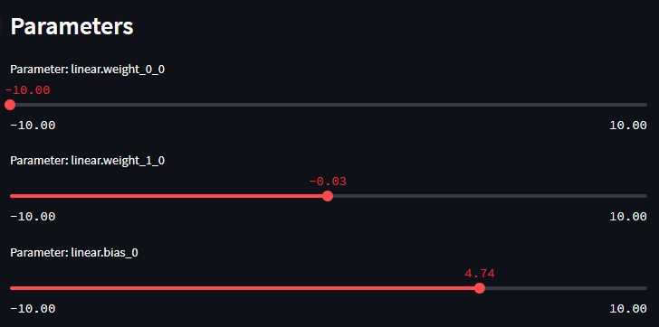

# MiniTorch Module 0

* Docs: https://minitorch.github.io/

* Overview: https://minitorch.github.io/module0.html

## Requirements

Python 3.9, doesn't work on Python 3.10 as of 2022-03-19 due to torch/numba/numpy version conflicts.

## Task 0.5 Manual Fitting

